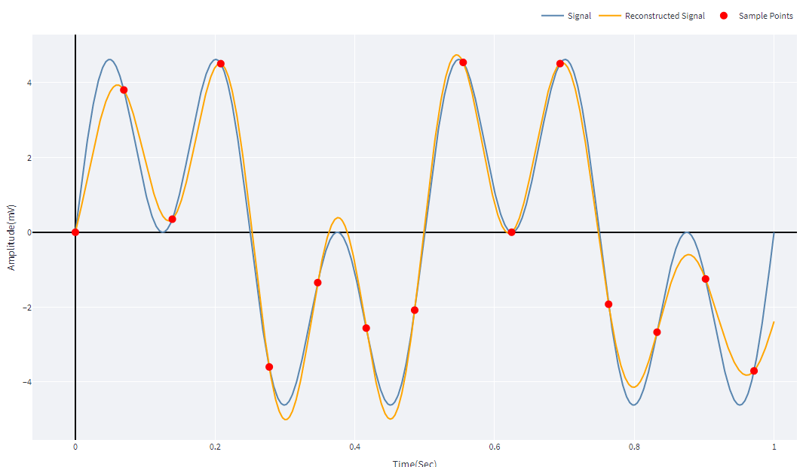

# Nyquist theorem

## Table of contents

- [Overview](#overview)
- [Examples](#examples)
- [concolusion](#concolusion)

## Overview

The Nyquist theorem specifies that a sinuisoidal function in time or distance can be regenerated with no loss of information as long as it is sampled at a frequency greater than or equal to twice per cycle.
 
which means that if fs more than or equal the max frequency in the signal, the signal can be reconstructed with no loss of main signal
 
 

## Examples

- Applying different sampling frequency on signal with 2 added signals(2Hz & 6Hz)

 

1- Sampling at nyquist frequency (Fs = 12 Hz) 

 

2- Undersampling at (Fs = 4 Hz) 
&emsp; 

 

3- Oversampling with pure signal (No noise)at (Fs = 30 Hz) 

 

4- Oversampling with noised signal at (Fs = 30 Hz)

 

   
   

## Concolusion

Sampling at exact nyquist rate or higher with a pure signal(no noise) can effectively expresss the whole main signal, while undersampling narrow the vision of signal to fs/2 frequency only (frequencies higher than fs/2 can not be noticed).
 
Oversamplig appears to be perfect, but we cannot have a pure noise whole the time. Oversampling with a noised signal will lead to high effects on reconstruted signal.
